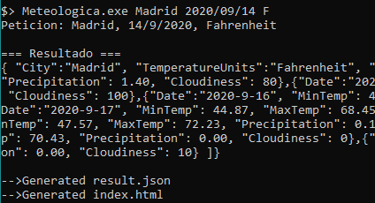
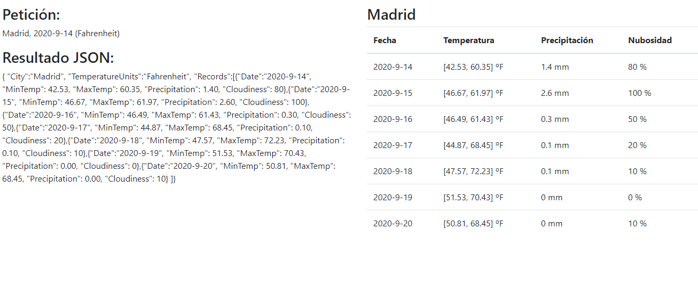

# Prueba técnica Meteologica - Sergi Romero Bonnin
## Comentario de la solución desarrollada

La solución ha sido desarrollada utilizando el lenguaje C con el compilador MinGW64 para Windows. 

### Estructura de datos

Para resolver el problema se ha diseñado una estructura de datos que aprovecha las características de los datos para consulta a costa de la inserción.

La estructura consiste en una tabla de hashing (resolviendo las colisiones mediante ***open hashing***)

Una consulta en la estructura consiste en acceder a la HashTable utilizando la ciudad (coste medio **O(1)**) y acceder al registro concreto por fecha (coste medio **O(log n)** dado que están ordenados y se puede utilizar búsqueda binária). En total, acceder a un registro de una ciudad para una fecha determinada tiene un coste de **O(log n)**.

### Optimización en memoria
Se han tomado varias consideraciones respecto a la gestión de la memória y el principio de localidad.

* La tabla de hash realiza peticiones de memoria dinámica para sus nodos internos para mayor flexibilidad ya que una misma consulta se realiza solo sobre una ciudad.

* Los registros de cada ciudad se almacenan contiguamente en un mismo bloque del heap para favorecer su iteración.

### Saneamiento de datos
Se ha comprobado que existen datos con formatos variables o con datos en blanco. Se han aportado las siguientes soluciones:

* **Nombres desiguales:** Se eliminan los espacios en blanco a ambos lados del nombre. 
* **Datos en blanco:** Por simplicidad se ha optado por establecer el valor 0
* **Floats con comma y punto:** Se aceptan ambos formatos (1.2 o 1,2)

## Ejemplos de uso

Para realizar una petición se ejecuta el programa con el siguiente formato de argumentos:

``Meteologica.exe City YYYY/MM/DD [F|C] CSV_FilePath``

Siendo el path del fichero .csv opcional (por defecto ./data.csv) y F o C las unidades de temperatura (Fahrenheit o Celsius respectivamente).

Este realizará la búsqueda y generará dos archivos:
* **result.json**: Fichero con datos json de la consulta
* **index.html**: Página estática que muestra los datos de la consulta en forma de tabla. Utiliza jquery y bootstrap para visualizar los datos.

### Ejemplo: Madrid, dia 14 de Septiembre de 2020, Fahrenheit

#### Ejecución 

#### Web

